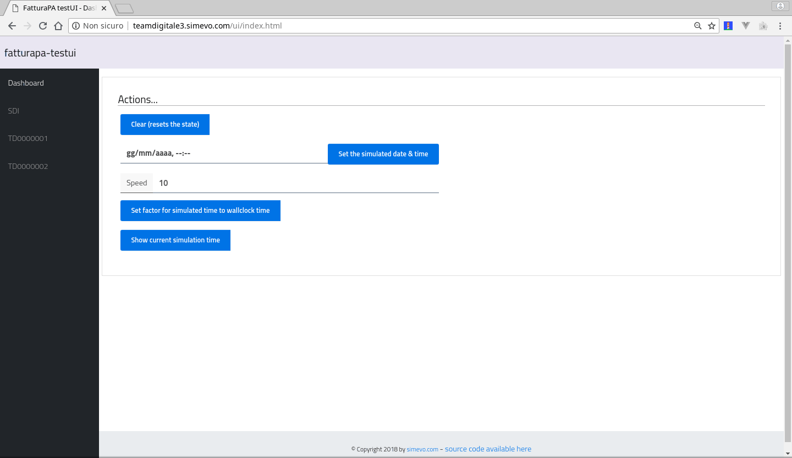

# fatturapa-testui

This repository contains a User Interface to connect to a test environment for the Exchange System (ES, Italian: SDI) for Electronic Invoices, and manually run a simulation of the complete process of invoice issue, transmission and receipt.

For more details, refer to [fatturapa-testsdi](https://github.com/italia/fatturapa-testsdi), the test environment for the Italian B2B invoice system.

## How it works

The UI reads and writes to the invoice and notification queues using the **testsdi** RPC interface provided by [fatturapa-control](https://github.com/italia/fatturapa-testsdi/rpc/packages/fatturapa/control/README.md).

The UI has a dashboard page where you can:
- clear (reset the state of all actors)
- set the current time
- set factor for simulated time to wallclock time

Additionally there is one page for the exchange system (**sdi**), and at least two for the issuer/receivers (**td000000x**).

Each issuer/receiver has separate tabs for the two roles (**Emissione** and **Ricezione**).

Each page or tab shows all the **invoice queues** for the role, and present buttons to force **actions** (i.e. upload invoice for the issuer, accept / refuse invoice for the receiver etc).

## Getting Started

Install on a testsdi instance by copying the content of the `www` directory into a `ui` dir side-by-side with the `/sdi` and `td0000000x` dirs, then visit https://testsdi.simevo.com/ui.

This screencast demonstrates an (incomplete) workflow:



## Testing

### Unit tests

TODO

### Linting

This project's JavaScript code complies with [JSHint code style](http://jshint.com/docs/).

Lint the JS code with:
```
./node_modules/jshint/bin/jshint www/js/www/js/InvoiceTable.js
./node_modules/jshint/bin/jshint --extract=auto www/index.html
./node_modules/jshint/bin/jshint --extract=auto www/td0000001.html
./node_modules/jshint/bin/jshint --extract=auto www/td0000002.html
```

This project's PHP code complies with the [PSR-2: Coding Style Guide](https://www.php-fig.org/psr/psr-2/).

Lint the PHP code with:
```
./vendor/bin/phpcs --standard=PSR2 xxx.php
```

## Contributing

For your contributions please use the [git-flow workflow](https://danielkummer.github.io/git-flow-cheatsheet/).

## Authors

Riccardo Mariani, Paolo Greppi

## License

Copyright (c) 2018, simevo s.r.l.

License: AGPL 3, see [LICENSE](LICENSE) file.
